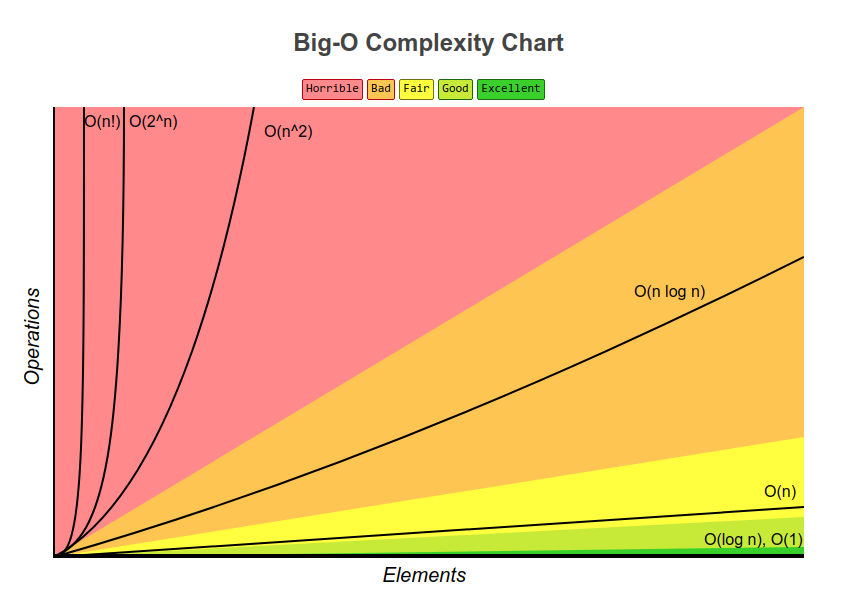
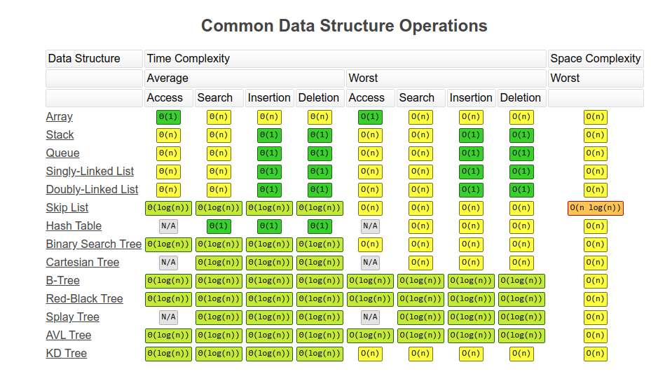
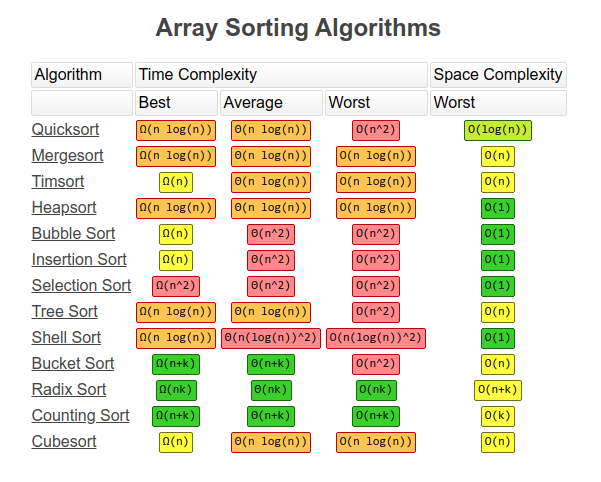

# deal

DEAL（Data structurEs And aLgorithms）

[](https://goreportcard.com/report/github.com/Promacanthus/deal) [](https://github.com/Promacanthus/deal/blob/master/LICENSE)

- [deal](#deal)
  - [Install](#install)
  - [Complexity](#complexity)
    - [Big O Complexity](#big-o-complexity)
    - [Common Data Structure Operations](#common-data-structure-operations)
    - [Array Sorting Algorithms](#array-sorting-algorithms)

## Install

```shell script
go get github.com/Promacanthus/deal
```

## Complexity

Image Source，click[here](https://www.bigocheatsheet.com/)。

### Big O Complexity



### Common Data Structure Operations



### Array Sorting Algorithms


